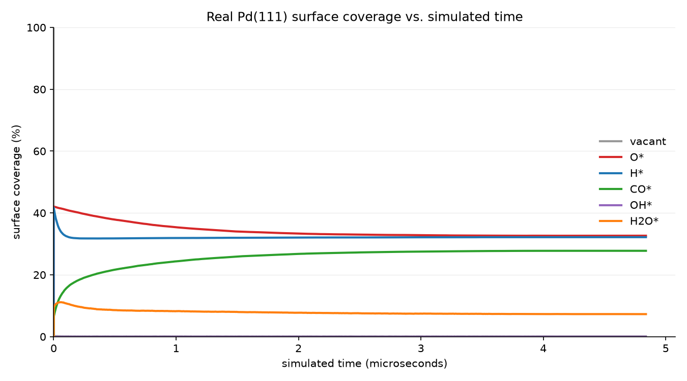

# kinetica

[](https://github.com/AndrejRumenovski/kinetica/actions/workflows/ci.yml)

**An asynchronous, out-of-core lattice kinetic Monte Carlo (kMC) engine
for surface-reaction simulation, written in pure Rust — driven by real
DFT-computed adsorption energies and transition-state barriers, not
synthetic placeholder rates.**



*O\*/H\*/CO\*/H2O\* coverage vs. simulated time, replayed from a real run
of this repo's own `kinetica` binary against its own `reactions.lut` —
reaction rates derived entirely from real Catalysis-Hub.org DFT data for
Pd(111) (see "Building `reactions.lut` from real data" below). Regenerate
it yourself with `coverage_report` + `scripts/plot_coverage.py` — see
"Visualizing a run".*

The lattice lives as a memory-mapped file rather than in heap-resident
`Vec`s, is a real hexagonal fcc(111) close-packed surface geometry (see
"Lattice geometry and target surface: Pd(111)" below) rather than a
generic square grid, and the simulation is spatially decomposed into
independently-scheduled `rayon` work-stealing patches whose fired-reaction
trajectory is streamed out through a double-buffered `io_uring` writer so
no compute thread ever blocks on disk I/O.

Two reaction-selection engines coexist, auto-selected from a magic header
in `reactions.lut` itself (no CLI flag to keep in sync): a **static**
composition-rejection sampler (O(1) next-reaction selection regardless of
how many fixed-rate channels are active — `kinetica --generate-lut`'s
synthetic demo mode) and an **occupancy-gated** one (real, `oc20_ingest`-
built data — propensity scales with how many lattice sites *currently*
match a reaction's reactant state, so a reaction can only ever fire where
its reactant genuinely is). See "Occupancy-gated kMC" below for why the
second one exists and how it works.

**What this project is meant to demonstrate**, as a portfolio piece:

- **Systems engineering** — zero-copy memory-mapped state, a cache-line-
  aligned AoSOA reaction table sized to fit whole hardware cache lines
  with no implicit padding, `unsafe` used narrowly and justified inline
  rather than avoided by pretending it isn't needed.
- **Concurrency** — `rayon` work-stealing spatial decomposition into fully
  independent patches, a double-buffered `io_uring` trajectory writer that
  never blocks a compute thread on disk I/O.
- **Algorithms** — O(1) composition-rejection stochastic simulation
  (Gillespie SSA) for the synthetic path, O(1) sparse-set free-lists for
  *exact* occupancy-gated site selection on the real-data path.
- **Scientific honesty** — every "real chemistry" claim below is checked
  against actual DFT records rather than assumed, and a negative result
  (data that turned out *not* to apply once actually checked) is
  documented as carefully as a positive one — see "Lattice geometry and
  target surface: Pd(111)" and "OC22: investigated, not integrated" for
  two examples where a plausible-looking data source didn't pan out, and
  the README says so instead of quietly moving on.

## Table of contents

- [Building](#building)
- [Layout](#layout)
- [Running the simulator](#running-the-simulator)
- [Visualizing a run](#visualizing-a-run)
- [Fuzzing](#fuzzing)
- [Benchmarks](#benchmarks)
- [Occupancy-gated kMC](#occupancy-gated-kmc)
- [Gas-phase pressure coupling](#gas-phase-pressure-coupling)
- [Lattice geometry and target surface: Pd(111)](#lattice-geometry-and-target-surface-pd111)
- [Broader reaction coverage: OH\* and water splitting](#broader-reaction-coverage-oh-and-water-splitting)
- [Widening past four species: H2O\*](#widening-past-four-species-h2o)
- [Building `reactions.lut` from real data](#building-reactionslut-from-real-data)
- [License](#license)

## Building

The hot Gillespie loop and the neighborhood-scan kernels in `layout.rs`
are written to vectorize under AVX2/FMA, which the default `rustc` target
does not enable. Always build with:

```sh
RUSTFLAGS="-C target-cpu=native -C target-feature=+avx2" cargo build --release
```

Because this bakes in host-specific instructions, resulting binaries are
not portable across heterogeneous CPU fleets — rebuild per target machine.

## Layout

| Path                    | Purpose                                                                 |
|--------------------------|-------------------------------------------------------------------------|
| `src/layout.rs`          | Bit-packed mmap'd lattice, cache-line-aligned `ReactionLutBlock` reaction table, LUT packing/writing, magic-header `LutKind` |
| `src/topology.rs`        | Neighbor topology (hexagonal, fcc(111) -- six neighbors per site) shared by the occupancy-gated engine and the bimolecular partner search |
| `src/gillespie.rs`       | O(1) partial-propensity composition-rejection (SSA-CR) reaction sampler, fixed-point propensity arithmetic -- the `Static`/`--generate-lut` engine |
| `src/occupancy.rs`       | Live per-patch occupancy counters + O(1) free-list site selection (bimolecular pair search still bounded-rejection) -- the `OccupancyGated`/real-data engine |
| `src/engine.rs`          | Spatial domain decomposition, rayon work-stealing, fully independent patches (no cross-patch communication), double-buffered `io_uring` trajectory writer, dispatch between the two engines |
| `src/lib.rs`             | Library surface shared by `kinetica` and auxiliary tools              |
| `src/main.rs`            | `kinetica` CLI entrypoint                                              |
| `src/bin/oc20_ingest.rs` | Builds `reactions.lut` from real adsorption-energy data (OC20 or Catalysis-Hub) |
| `src/bin/coverage_report.rs` | Replays `trajectory.bin` against `reactions.lut` into a per-species coverage-over-time CSV (see "Visualizing a run") |
| `scripts/extract_energies.py` | Pulls adsorption-energy records from OC20 IS2RE LMDB shards |
| `scripts/extract_catalysis_hub.py` | Pulls the same record format from the Catalysis-Hub.org GraphQL API, plus real transition-state barriers where they exist |
| `scripts/oc20e_format.py`     | Shared binary format both extraction scripts write |
| `scripts/plot_coverage.py`    | Turns `coverage_report`'s CSV into the coverage-vs-time PNG at the top of this README |

## Running the simulator

```sh
./target/release/kinetica \
    --lut-path reactions.lut \
    --lattice-path surface.lattice \
    --trajectory-path trajectory.bin
```

| Flag                 | Default            | Meaning                                  |
|-----------------------|---------------------|-------------------------------------------|
| `--lattice-path`      | `surface.lattice`  | Backing mmap file for the surface        |
| `--lattice-width`     | `4096`              | Lattice width in sites                   |
| `--lattice-height`    | `4096`              | Lattice height in sites                  |
| `--lut-path`          | `reactions.lut`     | Reaction rate-constant table             |
| `--trajectory-path`   | `trajectory.bin`    | Output fired-reaction trajectory log     |
| `--patches`           | available CPUs      | Spatial domains / rayon tasks            |
| `--steps`             | `1000000`           | Gillespie steps per patch                |
| `--generate-lut <N>`  | —                   | Synthesize `N` demo reactions into `--lut-path` instead of using a real one |
| `--pressure-o2 <F>`   | `1.0`                | Relative O2 partial pressure — gates O* adsorption |
| `--pressure-h2 <F>`   | `1.0`                | Relative H2 partial pressure — gates H* adsorption |
| `--pressure-co <F>`   | `1.0`                | Relative CO partial pressure — gates CO* adsorption |
| `--pressure-h2o <F>`  | `1.0`                | Relative H2O partial pressure — gates H2O* adsorption (not water splitting) |

The four `--pressure-*` flags are runtime simulator parameters, not baked
into `reactions.lut` — changing the feed-gas composition never requires
rebuilding the LUT. They only affect the occupancy-gated engine (real
data), and only an adsorption channel's propensity (`VACANT -> species`);
desorption and bimolecular reactions are untouched, since neither consumes
a gas-phase molecule. See "Gas-phase pressure coupling" below.

## Visualizing a run

`coverage_report` replays a `trajectory.bin` fired-reaction log against
`reactions.lut` to reconstruct per-species surface coverage over simulated
time (the log itself only stores `(sim_time, site_idx, reaction_id)` per
event, not the resulting occupancy) and prints it as CSV;
`scripts/plot_coverage.py` turns that into the PNG at the top of this
README:

```sh
./target/release/kinetica \
    --lattice-width 256 --lattice-height 256 --patches 8 --steps 150000
./target/release/coverage_report \
    --trajectory-path trajectory.bin --lut-path reactions.lut \
    --lattice-width 256 --lattice-height 256 \
    > coverage.csv
python3 scripts/plot_coverage.py coverage.csv coverage.png
```

`--lattice-width`/`--lattice-height` must match whatever the real run
used — `trajectory.bin` logs a flat global site index, not a `(width,
height)` pair, so `coverage_report` has no way to recover the lattice
shape on its own. Because `run_simulation`'s patches are fully independent
(see "Occupancy-gated kMC" below) and write to the trajectory file through
two alternating `io_uring` writer threads, records land in the file in
whatever order each patch/writer happened to be scheduled, not global
chronological order — `coverage_report` sorts every record by its own
logged `sim_time` before replaying, which is what makes "coverage at time
T" well-defined at all across independently-running patches.

## Fuzzing

`layout::ReactionLut::open` maps a `reactions.lut` file and reinterprets
its bytes as `[ReactionLutBlock]` via an `unsafe` pointer cast — sound
only because of the length/alignment checks that run *before* the cast
(see the function's own safety comment), not because the file is assumed
well-formed. `fuzz/fuzz_targets/reactions_lut_parse.rs` (via
[`cargo-fuzz`](https://github.com/rust-fuzz/cargo-fuzz)/libFuzzer) throws
arbitrary bytes at it and checks the one property that has to hold for
*any* input: `open` either returns `Err`, or a `ReactionLut` whose every
block and record can be read back out without panicking or triggering
undefined behavior (which ASan/UBSan, wired up by cargo-fuzz's default
sanitizer, would catch even where safe Rust can't observe it directly).

```sh
cargo install cargo-fuzz
rustup toolchain install nightly   # cargo-fuzz/libFuzzer requires nightly
cargo +nightly fuzz run reactions_lut_parse -- -max_total_time=300
```

A local 60-second run (1.46M executions) found no crashes before this was
committed. CI runs a bounded 60-second smoke test of the same target on
every push — not a substitute for a real fuzzing campaign, but enough to
catch a regression in this parsing path before it reaches `main`.

## Benchmarks

Real wall-clock numbers, not a marketing table — from the exact commands
below, on a 12-thread (6-core) AMD Ryzen 5 5600G, release build with the
recommended `RUSTFLAGS` (see "Building" above), a 1024×1024 lattice, and
this repo's own real Pd(111) `reactions.lut` (34 reactions) for the
occupancy-gated numbers:

```sh
RUSTFLAGS="-C target-cpu=native -C target-feature=+avx2" cargo build --release
./target/release/kinetica --lattice-width 1024 --lattice-height 1024 \
    --patches <N> --steps 2000000
```

| Patches | Occupancy-gated (real data) | Static (`--generate-lut`) |
|---|---|---|
| 1  | 1.08M reactions/sec | 5.35M reactions/sec |
| 2  | 3.22M reactions/sec | 5.41M reactions/sec |
| 4  | 5.86M reactions/sec | 6.14M reactions/sec |
| 6  | 6.02M reactions/sec | 5.46M reactions/sec |
| 8  | 5.03M reactions/sec | 5.50M reactions/sec |
| 12 | 4.18M reactions/sec | 4.26M reactions/sec |

Two honest things this table shows, rather than hides:

**Throughput peaks around 4-6 patches and *degrades* beyond that**, on
this 6-physical-core/12-thread machine. `--patches` defaults to
`rayon::current_num_threads()` (all logical CPUs), which this data says
is actually past this workload's sweet spot here — every patch's fired
events funnel through one shared trajectory-writer pipeline (two
`io_uring` writer threads regardless of patch count, see "Occupancy-gated
kMC" below), so beyond a machine-specific point, more compute patches
means more contention feeding that shared pipeline, not more useful
parallelism. Reported as measured rather than only benchmarking at the
patch count that looks best — if you're tuning `--patches` for your own
hardware, sweep it; don't assume "more" or "the default" is optimal.

**The static and occupancy-gated engines are now comparably fast**,
which is itself worth stating because it *wasn't* true when this table
was first being assembled: an early pass measured the static engine at
roughly **1000x slower** (thousands, not millions, of reactions/sec).
Chasing that discrepancy down (rather than writing benchmark numbers that
would have quietly enshrined it) found a genuine bug in
`gillespie::CompositionTable::bin_ceiling` — it used `FixedPoint::FRAC_BITS`
(32, the fixed-point *type's* own width) as a shift base instead of 16
(the number of bits `FixedPoint::from_q16` actually shifts a Q16.16 rate
by to get there), making every rejection-sampling bin's acceptance
envelope `2^16` (65536x) too large. The module's own doc comment claims
"expected <= 2 rejection trials"; the bug silently turned that into
*expected ~65536 trials per event*. Two existing unit tests had encoded
the bug as correct behavior (they asserted `bin_ceiling`'s own output
rather than a value derived independently from the invariant it's
supposed to satisfy) and so never caught it — a reminder that a green
test suite proves the tests you wrote pass, not that every documented
property actually holds; this one only surfaced by measuring real
wall-clock throughput and asking why a number looked wrong. Fixed in
`gillespie.rs` (see its own doc comment on `bin_ceiling` for the exact
derivation); both misleading tests were rewritten to derive their
expected values from `FixedPoint::from_q16`'s actual shift instead of
mirroring the implementation.

## Occupancy-gated kMC

Earlier versions of this engine treated every reaction as an independent,
always-available channel: `gillespie::CompositionTable` built its
propensity index once from `reactions.lut` alone, never touching the
lattice, and a fired reaction was applied to a *uniformly random* site
with no check that the site actually held the reactant. For
`--generate-lut`'s synthetic demo data that's a reasonable simplification
(the point is exercising the HPC architecture, not real chemistry). For
real, `oc20_ingest`-built data it was a genuine correctness gap: an
adsorption event applied via a bitwise OR to an already-occupied site
would silently set two adsorbate bits on the same site at once, and
propensities had no way to reflect the surface actually running out of a
species to desorb or filling up so there was nowhere left to adsorb.

`src/occupancy.rs` fixes this for real-data LUTs. Every lattice site's
"which quantile bucket does this site belong to, for a given species" is a
deterministic hash of its own index (`occupancy::site_bucket`) — no
per-site storage. Each patch keeps a live count, per (species, bucket), of
how many sites are currently vacant (what an adsorption template's
propensity scales with) or occupied by that species (what a desorption
template scales with), plus a live count of adjacent pairs for each
bimolecular reaction type (O\*/CO\*, H\*/H\*, H\*/OH\*, and a shared
adjacent-vacant-pair count every dissociative-adsorption reaction draws
from) — all updated in O(1) amortized time per fired event, never
rescanned. Site selection for bucketed (monomolecular) reactions is an
exact, guaranteed-O(1) live free-list (`BucketedSet`: a dense array of
matching site indices plus an O(1) position lookup for removal), not
rejection sampling — insert/remove/random-pick are all O(1) with no
retry loop, trading a small amount of extra memory (the position lookup,
sized to the patch, once per species/vacant-or-occupied) for a
worst-case time guarantee. Bimolecular pair search still uses bounded
rejection sampling (try a random candidate, verify it actually matches,
retry on a miss, fall back to a guaranteed deterministic scan after
enough misses) — real bimolecular records are kept un-bucketed (there
are only a handful), so there's no per-bucket structure for a pair
free-list to key off without inventing a separate edge-indexed
structure, left as a future item of its own if it ever shows up as a
bottleneck in practice.

**Both engines share the on-disk `ReactionLutBlock` format** but interpret
it differently, so `reactions.lut` now starts with an 8-byte magic header
(`KMCSTAT1` for `--generate-lut`'s static LUTs, `KMCOCC01` for
`oc20_ingest`'s occupancy-gated ones) that `kinetica`'s `run()` reads to
pick the right engine automatically — no flag to remember or get out of
sync with how the file was actually built. For an occupancy-gated LUT,
`bin_id` means "which quantile bucket" (0..4) rather than "composition-
rejection magnitude class"; see `oc20_ingest`'s docs for where that bucket
index comes from.

**This intentionally didn't try to fix everything at once.** Occupancy-gating
changes *how* a reaction is selected and applied, not *what* chemistry the
underlying rate constants represent. The next two sections close two more
of the gaps this left open: gas-phase partial pressure, and the lattice's
real geometry / which real surface its rate constants are actually
measured on.

## Gas-phase pressure coupling

Before this, every run's adsorption kinetics were identical regardless of
feed-gas composition: `reactions.lut`'s rate constants encode a fixed
propensity per adsorption channel, with no notion of how much of each gas
is actually present above the surface. Two runs meant to represent, say, a
CO-rich feed versus an O2-rich one produced exactly the same coverage
trajectory.

`--pressure-o2`/`--pressure-h2`/`--pressure-co`/`--pressure-h2o` (default
`1.0` each) are runtime multipliers, not LUT-baked constants —
`occupancy::Pressures`
scales an adsorption template's propensity by the matching species'
relative pressure at the point `total_propensity`/`select_event` compute
live weights, alongside the existing `rate_q16 * live_count` factors. Nothing
about the LUT itself changes, so switching feed-gas composition between
runs is just a CLI flag, not a rebuild. Only adsorption is affected —
identifiable as a template whose reactant is `VACANT` (`reactant_mask ==
0`) — since desorption and bimolecular reactions don't consume a
gas-phase molecule in the first place; scaling their propensity by a
partial pressure wouldn't correspond to anything physical.

Verified against the real Pd(111) `reactions.lut` and release binary:
identical starting lattices, identical seeds, differing only in
`--pressure-co` — baseline (`1.0`) settles at 45.0% CO coverage; `20.0`
settles at 72.1%, with O and H coverage correspondingly displaced (all
three compete for the same finite pool of vacant sites). Zero invalid
occupancy states in either run.

## Lattice geometry and target surface: Pd(111)

The lattice is a real fcc(111) close-packed surface — six equidistant
nearest neighbors per site, not the generic square/4-neighbor grid earlier
versions used. `src/topology.rs` centralizes what "adjacent site" means
(previously duplicated, inconsistently, across `occupancy.rs` and
`engine.rs`) and models the hex grid as an offset-coordinate ("odd-r")
reinterpretation of the same flat row-major mmap — no storage change, just
row-parity-dependent column offsets for the diagonal neighbors, so every
row zig-zags into true close-packed alignment. `topology::all_neighbors`
returns up to six neighbors; `topology::forward_neighbors` returns the
canonical half (three) a full-grid scan uses to count every unordered
adjacent pair exactly once.

`reactions.lut`'s real data is now filtered to a single real
crystallographic surface — **Pd(111)** — instead of pooling DFT samples
from every metal/facet a species happens to appear on. `oc20_ingest
--metal Pd --facet 111` (see below) restricts monomolecular O/H/CO
adsorption data to that one surface, with a per-species fallback to
"Pd, any facet" logged explicitly if a species' facet-filtered pool is too
sparse to bucket meaningfully (see `oc20_ingest --help`).

**Real bimolecular (CO-oxidation, H2-recombination) barriers are absent
from a strict Pd(111) build — a genuine, checked finding, not an
oversight.** Tracing the exact `surfaceComposition`/`facet` metadata behind
the two previously-cited real barriers turned up:

- The CO-oxidation barrier (`StreibelMicrokinetic2021`, ~0.98–1.21 eV) is
  real and on pure Pd, but at facet **(211)**, not (111) — plus a second
  record on an oxide-modified `Pd+1:3O` surface (excluded outright by the
  pure-single-element metal filter, since it isn't elemental Pd).
- The H2-recombination barrier (~0.35 eV) is on `PdH`-hydride surfaces
  (`PdH-hcp-4layer`/`PdH-hcp-6layer`) at non-clean facet labels
  (`101-0.75MLfccH`, etc.) — a hydride, not clean metallic Pd.

Neither survives a filter that means what it says ("real Pd(111) metal").
So this build's `reactions.lut` has real, Pd(111)-specific monomolecular
O/H/CO adsorption/desorption chemistry and **zero *recombination*
bimolecular reactions** (CO-oxidation, H2-recombination) — rather than
quietly keeping the old cross-facet/cross-composition bimolecular records
under a "Pd" label that would itself be exactly the kind of pooling this
change exists to eliminate.

**A follow-up, metal-unfiltered survey closed the obvious next question —
"is there a different metal where this data isn't compromised?" — with a
checked no.** Scanning every real-barrier record in the database (not just
Pd's), merged across several passes to work around this database's own
run-to-run pagination flakiness (see "These real barriers are rare and
vary run to run" below), turns up only **5 real recombination records in
total**, covering just these same two reactions, and every one of them is
on Pd — Pd(211), oxide-modified Pd, or `PdH`-hydride, never a clean
single-element (111) facet. No other metal has a real recombination
barrier for either reaction, at any facet. So this was never a
Pd-specific gap to route around by picking a better metal (option (b) in
the project handoff's "Next step" list) — real recombination
transition-state calculations are simply rare in this literature across
the board, and Pd happens to be the only metal anyone has published them
for. Restoring recombination chemistry on a real, clean single-crystal
surface is therefore waiting on this data source publishing more such
calculations, not on a smarter choice of target metal. A different real
bimolecular reaction — water splitting — *does* survive strict Pd(111)
filtering; see "Broader reaction coverage: OH\* and water splitting"
below.

## Broader reaction coverage: OH* and water splitting

A fourth adsorbate, **OH\*** (`layout::ADS_OH`), joins O\*/H\*/CO\* —
formed and consumed by a real, genuinely two-site reaction found on
Pd(111): dissociative water adsorption/associative desorption,
`2* + H2O(g) <-> H* + OH*` (Ea forward ≈ 1.01–1.18 eV across two real DFT
samples). This is the textbook first step of surface water
formation/decomposition chemistry, and — unlike CO-oxidation/H2-
recombination — its reverse (associative desorption) genuinely is the
same elementary step run backward, so `oc20_ingest` builds *both*
directions from the one real forward barrier, using the same
`Ea_rev = Ea_fwd - dE_rxn` thermodynamic-consistency relation the
monomolecular adsorption/desorption pairs already use.

**Four species used to be a hard ceiling for this architecture — since
widened to eight, see "Widening past four species: H2O\*" below.** At the
time OH\* was added, `layout::apply_transition` packed a reaction's
reactant and product species into a single byte as two 4-bit nibbles
(`(reactant_mask << 4) | product_mask`); a one-hot species bit had to fit
inside one nibble, capping `SPECIES_BITS` at `{0x01, 0x02, 0x04, 0x08}`.
OH\* was chosen to fill that last slot over two lower-priority candidates
(CHO\*, H2O\* as a standalone molecular adsorbate) specifically because
it's the one with a *real, measured* two-site barrier and the most direct
connection to the O\*/H\* chemistry already modeled — see the project
handoff for the data-landscape survey behind that call.

**Engine-side, this needed remarkably little new code.** Site
selection (`find_bimolecular_pair`) already handled an arbitrary reactant
species generically, VACANT included — zero changes there. What did need
updating: `occupancy::OccupancyCounters::live_count`'s old bimolecular
branch was an unconditional `if O-or-CO { co_ox_pairs } else { h2_pairs }`
two-way split, which would have silently miscounted this reaction's
reverse (an H\*/OH\* pair, neither O/CO nor H/H) against the wrong pool.
It's now an exhaustive match over every known pair type, with a safe
`0` fallback for anything unrecognized — a reaction this build doesn't
know about is simply never selected, not miscounted. `pressure_factor`
also needed a new case: water splitting's forward direction genuinely
consumes a gas-phase molecule (H2O), but at the time `occupancy::Pressures`
only tracked O2/H2/CO, and naively keying off site A's product species
(H\*, which *does* have a pressure slot) would incorrectly gate this
reaction on H2 pressure instead. It's treated as pressure-neutral instead
— a documented simplification, not a silent bug (this remains true even
after `Pressures` gained a real H2O slot — see below for why water
splitting still can't use it).

**A real-scale finding worth stating plainly: water splitting is
correctly wired into the real Pd(111) `reactions.lut`, but at these
species' relative rates it's effectively unobservable in a normal run.**
The Bronsted-Evans-Polanyi relation this pipeline uses clamps one
direction of *every* monomolecular adsorption/desorption pair to a
barrierless `Ea = 0` whenever `alpha != 1` (a structural property of the
relation with `beta = 0`, not specific to any one species) — in practice,
real Pd(111) O/H/CO adsorption energies are all exothermic, so every
adsorption channel ends up essentially barrierless (`rate_q16` at or near
the Q16.16 ceiling), while water splitting's *real* ~1.0–1.2 eV barrier
gives it a `rate_q16` at the floor (clamped to `1`) once rescaled against
that ceiling — roughly a two-billion-fold propensity disadvantage. Layer
on that a saturated surface (near-barrierless adsorption fills the
lattice almost immediately) leaves very few adjacent *vacant pairs* for
water splitting to find in the first place, and the reaction essentially
never fires within a normal step budget. This isn't a bug: it's an honest
reflection of water splitting genuinely being the rate-limiting step
relative to simple adsorption at these DFT-derived rates — the same
qualitative story as real Pd/Pt surface science. It was verified working
correctly, using the real DFT numbers, in isolation (a throwaway LUT
containing *only* the two water-splitting records, no competing
channels): starting from an empty lattice, forward and reverse each fired
~100k times over 200k total events, settling into a small,
detailed-balance-consistent equilibrium population of adjacent H\*/OH\*
pairs, zero invalid occupancy states.

## Widening past four species: H2O*

A fifth adsorbate, **H2O\*** (`layout::ADS_H2O`), joins O\*/H\*/CO\*/OH\* —
formed and consumed by an ordinary, real Pd(111) monomolecular reaction:
molecular water adsorption/desorption, `star + H2O(g) <-> H2Ostar`. This is
*not* the same reaction as water splitting above — H2O\* is water sitting
intact on a single site, distinct from the H\*/OH\* dissociation products
splitting produces on two sites. Real Catalysis-Hub Pd(111) samples exist
for this pattern (3-4 records, count drifts slightly run to run — see
"These real barriers are rare and vary run to run" below), BEP-estimated
like O\*/H\*/CO\* since none carried a real activation energy at the time
this was checked.

**This required an actual architectural change, not just a new species
constant.** `SPECIES_BITS` was hard-capped at four because
`layout::apply_transition` packed a reaction's reactant and product
species into a single byte as two 4-bit nibbles — a 5th one-hot bit
(`0x10`) would have bled into the other nibble and silently corrupted the
encoding (see the section above). The fix widens the packing unit from a
nibble to a full byte: `transition_a`/`transition_b` are now `u16`
(`(reactant_mask << 8) | product_mask`), each mask a one-hot byte, raising
the ceiling from 4 species to 8. Deliberately *not* a switch from one-hot
bitmask occupancy to a compact species-index encoding, even though that
would have kept the nibble packing and needed no `ReactionLutBlock`
resize at all — the bitmask's "more than one bit set is corruption" shape
is exactly what `engine.rs`'s end-to-end test
(`run_simulation_occupancy_gated_never_produces_an_invalid_multi_bit_site`)
uses to catch a reaction firing on an unverified site, a real bug class
this project hit once already (see "Occupancy-gated kMC" above). Keeping
that verification technique intact, at the cost of `reactions.lut` size,
was judged worth more than the byte savings.

**Widening `transition_a`/`transition_b` moved `ReactionLutBlock` off a
single 64-byte cache line.** Each lane grew from 8 bytes to 10
(`rate_q16` 4 + `bin_id` 1 + `transition_a` 2 + `transition_b` 2 +
`is_bimolecular` 1); `LANES` (reactions packed per block) had to change
from 8 to a value where `10 * LANES` is itself a clean multiple of 64, so
every block in the array stays cache-line-aligned with **no implicit tail
padding** — padding would mean writing/reading uninitialized bytes when
`write_lut`/`ReactionLut::open` reinterpret the struct as a raw byte
slice, which the existing safety comments are explicit about avoiding.
`LANES = 32` is the smallest lane count with zero waste, giving a
320-byte, 5-cache-line block instead of a 1-line one — a real, deliberate
cost (more bytes per reaction, more lines touched per block access) paid
for real headroom (up to 8 species, only 5 used) rather than squeezing in
exactly one more species and immediately hitting the ceiling again.

**`occupancy::Pressures` also gained a real 5th slot.** Unlike water
splitting, H2O\* adsorption is an *ordinary* single-gas monomolecular
channel — same shape as O2/H2/CO — so it gates on its own partial pressure
exactly like they do: `kinetica --pressure-h2o <F>`. This is a genuinely
different situation from water splitting's own gas-phase dependency,
which stays pressure-neutral even now that a real H2O slot exists: water
splitting's forward direction produces *two different* species (H\* and
OH\*) on two different sites, so there's still no single product species
that identifies "this reaction's gas was H2O" the way H2O\* itself does.
`Pressures`' 4th slot (index 3, OH) stays permanently unused for the same
reason — OH\* only ever forms via that same short-circuited path.

**Verified against the real Pd(111) `reactions.lut` through the actual
release binary.** A rebuild with the current live data (O:6, H:9, CO:3,
H2O:4 real monomolecular records, 2 real water-splitting bimolecular
records, 0 recombination) produced 34 reactions (up from 26); a 128×128
lattice run from a clean start reached zero invalid occupancy states with
H2O\* genuinely present on the lattice (1,112 of 16,384 sites, ~6.8%, at
default pressures). Pressure coupling was checked the same way the
CO/H2/O2 knobs were originally verified: `--pressure-h2o 20.0` raised H2O\*
coverage to 21.1% with O\*/CO\* correspondingly displaced (all species
still compete for the same vacant-site pool), zero invalid occupancy
states in either run. All 91 tests continue to pass, `cargo clippy
--all-targets` stays clean, and no test needed a new verification
strategy — every existing assertion (including the multi-bit-occupancy
canary above) transferred over the widened encoding unchanged.

## Building `reactions.lut` from real data

Two independent real-data sources feed the same `oc20_ingest` pipeline;
see the CO-gap note below for why you likely want both. A third candidate,
OC22, was investigated and found not to apply to this project — see "OC22:
investigated, not integrated" below.

### OC20

OC20's IS2RE task publishes only relaxed adsorption energies (initial
structure guess → DFT-relaxed structure and energy), not transition-state
barriers or rate constants. `oc20_ingest` bridges that gap with two
standard computational-catalysis approximations:

1. **Bronsted-Evans-Polanyi (BEP) relation** — estimate an activation
   energy from a reaction energy: `E_a = max(0, alpha * dE_rxn + beta)`.
2. **Harmonic transition-state theory / Arrhenius** — convert that barrier
   into a rate constant: `k = nu * exp(-E_a / (kB * T))`.

### Prerequisites

`scripts/extract_energies.py` needs only two pip packages — no `torch` or
`torch_geometric` install required, since it reads the LMDB container
directly and unpickles each record with a stub `Unpickler` that discards
every torch-specific field it doesn't need:

```sh
pip install --user lmdb numpy
```

### Pipeline

1. Download the OC20 IS2RE bundle and the adsorbate-mapping file into
   `data/oc20/` (both untracked/gitignored):

   ```sh
   mkdir -p data/oc20
   curl -o data/oc20/is2res_train_val_test_lmdbs.tar.gz \
       https://dl.fbaipublicfiles.com/opencatalystproject/data/is2res_train_val_test_lmdbs.tar.gz
   curl -o data/oc20/oc20_data_mapping.pkl \
       https://dl.fbaipublicfiles.com/opencatalystproject/data/oc20_data_mapping.pkl
   ```

   The full tar is 8.1GB compressed; extract only the split you need
   rather than all of it (LMDB shard sizes below are real, not sparse):

   | Split (`train/`) | Compressed extract | Real size on disk |
   |-------------------|--------------------|--------------------|
   | `10k`             | fast                | 1.3GB              |
   | `100k`            | a few minutes       | 13GB               |
   | `all`             | slow                | 62GB               |

   ```sh
   tar -xzf data/oc20/is2res_train_val_test_lmdbs.tar.gz \
       -C data/oc20 is2res_train_val_test_lmdbs/data/is2re/100k/train/
   ```

   > **Filesystem note:** reading a `100k`-or-larger shard with `lmdb`'s
   > mmap while it sits on an NTFS mount (`ntfs3`/FUSE) can crash with a
   > `Bus error` (`SIGBUS`) partway through the scan. The `10k` split was
   > fine in place; for `100k`/`all`, copy the shard to a native Linux
   > filesystem (ext4, etc.) first and run the extraction from there.

2. Extract `(species, energy, sid)` records from the LMDB shard:

   ```sh
   python3 scripts/extract_energies.py \
       --lmdb data/oc20/is2res_train_val_test_lmdbs/data/is2re/100k/train/data.lmdb \
       --mapping data/oc20/oc20_data_mapping.pkl \
       --out data/oc20/energies_all.bin
   ```

3. Convert those energies into a `reactions.lut`:

   ```sh
   cargo run --release --bin oc20_ingest -- \
       --input data/oc20/energies_all.bin \
       --out reactions.lut
   ```

   `--alpha`, `--beta`, `--nu`, and `--temperature` override the BEP/TST
   defaults — see `oc20_ingest --help`.

`oc20_ingest` logs a per-species record count so any coverage gap is
visible rather than silent. In particular, OC20's `train`/`val` splits
contain **no `*CO` samples at all** — `*CO` is one of the benchmark's
deliberately held-out "unseen adsorbate" out-of-domain test classes, and
the `test_*` splits ship with `y_relaxed`/`y_init` withheld (`None`) to
prevent leaderboard cheating. So a `reactions.lut` built from OC20 alone
will always have real O and H adsorption/desorption chemistry but zero CO
reactions. (Checked directly: OC20's `100k` train split already contains
~97.5% of every O/H sample that exists anywhere in the full 460k-sample
`all` split — re-extracting a bigger split won't find more O/H data
either.)

### Alternative/supplemental source: Catalysis-Hub.org (fills the CO gap, and has some real barriers)

[Catalysis-Hub.org](https://catalysis-hub.org) is a separate, curated
database of DFT chemisorption/reaction energies across many publications,
queryable live over a public GraphQL API — no multi-GB download needed.
Unlike OC20 it has real `*CO` adsorption data:

```sh
python3 scripts/extract_catalysis_hub.py --out data/oc20/energies_catalysis_hub.bin
cargo run --release --bin oc20_ingest -- \
    --input data/oc20/energies_catalysis_hub.bin \
    --out reactions.lut
```

**Restricting to one real surface (`--metal`/`--facet`).** Both the
extraction script and `oc20_ingest` accept `--metal`/`--facet` filters —
pushed down to the GraphQL API as server-side `surfaceComposition`/`facet`
filter args on the extraction side, applied post-hoc (with a per-species
fallback to metal-only if `--facet` leaves too few samples to bucket) on
the ingest side. This is what this repo's own `reactions.lut` is built
from — see "Lattice geometry and target surface: Pd(111)" above:

```sh
python3 scripts/extract_catalysis_hub.py \
    --out data/oc20/energies_pd111.bin \
    --metal Pd --facet 111
cargo run --release --bin oc20_ingest -- \
    --input data/oc20/energies_pd111.bin \
    --metal Pd --facet 111 \
    --out reactions.lut
```

`--metal` matches against a *pure single element* formula (via
`oc20e_format.parse_pure_metal`) — an alloy, intermetallic, oxide, or
hydride surface (e.g. `PdPt`, `Pd+1:3O`, `PdH`) is excluded, not folded in
under the pure metal's name, even though the database's own
`surfaceComposition` string sometimes does exactly that. `--facet` matches
a plain decimal Miller-index string (`"111"`); facet labels with suffixes
(`"110-lc-Ovac"`) or non-numeric content don't match anything and are
tagged "unknown" (`facet_code` returns 0) rather than silently
mis-parsed. Sample counts at this level of filtering are small (tens, not
thousands, per species) — `oc20_ingest`'s per-species fallback log line
makes it visible whenever a species had to broaden from "this facet" to
"this metal, any facet" to reach `BUCKETS_PER_SPECIES` (4) samples.

`scripts/extract_catalysis_hub.py` runs two passes. The bulk sweep
paginates the API for the elementary adsorption step
`star + <gas> -> <adsorbate>star` per species (`O2gas` at 0.5
stoichiometry, `H2gas` at 0.5, `COgas` at 1.0), keeping only exact matches
(no co-adsorbates or lumped multi-step reactions) — reaction energies
only, same as OC20, so `oc20_ingest` still applies BEP to these. Uses only
the Python standard library (`urllib`, `json`, `base64`) — no pip install
needed, unlike the OC20 path. A full run (no `--limit-per-species`) takes
a few minutes and yields on the order of 1-1.5k O, 8-12k H, and 5-6k CO
real reactions (varies run to run — this is a live, growing database).

**A small second pass finds genuine transition-state barriers.** Most
entries in this database, like OC20, only have relaxation/adsorption
energies — the schema's `activationEnergy` field is `null` for the
overwhelming majority of its 158k+ reactions. But a handful of
publications (`FalsigOn2014`, `WangUniversal2011`, `CatappTrends2008`,
`JiangTrends2009`, and others) *do* report real NEB/dimer-method barriers
for O₂, H₂, and CO dissociative/molecular adsorption across several metal
surfaces — around 40 records as of this writing. `oc20_ingest` uses these
directly for the forward (adsorption) direction instead of the BEP
estimate, deriving the reverse (desorption) barrier from the same
thermodynamic-consistency relation (`Ea_rev = Ea_fwd - dE_rxn`) it always
uses. It logs how many records per species carried a real barrier so this
is visible, e.g.:

```
oc20_ingest: species O: 1368 adsorption-energy records  (15 with a real DFT-computed activation energy, not BEP)
oc20_ingest: species O: collapsed into 4 quantile bucket(s) (sizes: 342, 342, 342, 342)
```

That second line is `bucket_by_quantile` at work: `oc20_ingest` doesn't
build one `ReactionRecord` per DFT sample (hundreds per species) — it
sorts a species' samples by reaction energy, splits them into
`BUCKETS_PER_SPECIES` (4) roughly-equal groups, and collapses each group
into one representative adsorption/desorption template built from the
group's mean energy (mean real Ea too, if any group member has one). This
is what makes occupancy-gating (above) tractable: a handful of templates
per species, each genuinely tied to a live count of matching lattice
sites, rather than hundreds of statically-always-available channels with
no notion of the lattice's current state. It also keeps real
heterogeneity — a genuinely fast-reacting quartile of surfaces versus a
genuinely slow-reacting one — rather than washing everything out into one
averaged number.

**There's also real barrier data for actual bimolecular surface reactions
like CO oxidation itself, `O* + CO* -> CO2 + 2*`** — see "Bimolecular
reactions" below for how this is now wired all the way through.

### OC22: investigated, not integrated

The obvious next candidate for a third data source was
[OC22](https://arxiv.org/abs/2206.08917) (Open Catalyst 2022), the
sibling dataset to OC20. It was investigated against this project's two
open questions — does it have in-domain `*CO` data, and does it have real
recombination barriers (CO-oxidation, H2-recombination) on a clean facet
that Catalysis-Hub doesn't — and closed as **not applicable**, for two
independent reasons found directly in the dataset's own methodology
section rather than by downloading and probing it empirically:

- **OC22 is oxide-only, by construction, not by filtering.** Its bulk
  structures are sampled from "4,728 unary (AₓOᵧ) and binary (AₓBᵧOᵤ)
  metal-oxides" — every entry contains oxygen. This project's target
  surface is elemental Pd(111), a clean single-crystal metal facet with
  zero oxide content (see "Lattice geometry and target surface: Pd(111)"
  above, and the deliberate exclusion of oxide-modified `Pd+1:3O` there).
  There is no elemental-metal slab to filter down to — `--metal Pd
  --facet 111` would have nothing to match against, the same
  "verify domain before trusting a headline number" lesson learned twice
  already with Catalysis-Hub records (Pd(211) and `PdH`-hydride, not
  Pd(111) — see above and "Broader reaction coverage" below).
- **OC22 has no transition-state or barrier data at all — it's a
  relaxation-only dataset, structurally identical in this respect to
  OC20.** It reports DFT total energies/forces for relaxed adsorbate+slab
  structures, not NEB/dimer-method activation energies. That's exactly
  the gap OC20 had and Catalysis-Hub's `activationEnergy` field filled;
  OC22 would reopen the same gap it doesn't close, so it can't supply the
  recombination barriers the "real recombination records are only 5 in
  the entire [Catalysis-Hub] database" finding above is asking a third
  source to provide.

Both findings come straight from the dataset's own methodology
description (bulk selection: oxides only; data product: relaxation
energies/forces only), so no download or extraction run was needed to
reach a checked answer — the domain mismatch is definitional, not a
sparse-sample gap that a bigger pull might fix. If a future oxide-focused
extension of this project's scope existed, OC22 would be the source; for
strict Pd(111) metal-facet chemistry, it isn't.

### Bimolecular reactions

Each `ReactionLutBlock` lane carries a second `(reactant_mask << 4) |
product_mask)` transition (`transition_b`) plus an `is_bimolecular` flag,
alongside the original single-site `transition_a`. A monomolecular
(adsorption/desorption) reaction only ever touches `transition_a`'s site,
exactly as before. How the two sites get *chosen* differs by engine (see
"Occupancy-gated kMC" above):

- **Static** (`--generate-lut` demo data): site A is a uniformly random
  patch site; site B is one of its same-patch hex-topology neighbors (see
  `topology::all_neighbors`), picked without checking either site's actual
  occupancy -- fine for exercising the architecture, not meant to be
  chemically exact.
- **Occupancy-gated** (real, `oc20_ingest`-built data): site A is
  rejection-sampled until it genuinely holds the reaction's first
  reactant species; site B is deterministically checked among site A's
  (up to six) neighbors for the second reactant species, retrying the
  whole pair on a miss. A bimolecular reaction can only ever fire on a
  site pair that actually has both reactants present.

Both constrain site B to the *same patch* as site A (rather than possibly
crossing into a neighboring `rayon` task's row band), so both sites update
as a single atomic step in that patch's own trajectory with no cross-
thread synchronization needed. If site A has no same-patch neighbor at all
(a degenerate 1×1 patch), the event is skipped rather than forced onto an
invalid site.

`kinetica --generate-lut` synthesizes roughly 1 in 8 demo reactions as
bimolecular so the static path is exercised even without real data on
hand.

**Dissociative adsorption (O2, H2).** O2 and H2 adsorb *dissociatively* —
the real elementary step is `2* + O2(g) -> 2 O*` / `2* + H2(g) -> 2 H*`,
consuming two adjacent sites at once, not one. Earlier versions modeled
this as two independent monomolecular events (`VACANT -> O*` twice),
energetically correct per atom (the extracted DFT energy already uses the
right 0.5-stoichiometry-per-atom convention) but kinetically wrong — two
single-site channels have no notion that they're really one two-site
event, so there's no site-pair-blocking coverage dependence: a lattice
running out of *adjacent* vacant pairs (as opposed to just vacant sites)
kept adsorbing at the same rate. `oc20_ingest` now builds these species'
adsorption as genuine `is_bimolecular` records instead — same reaction
data and BEP/Arrhenius model as before, just correctly gated on
`occupancy::OccupancyCounters::vacant_pairs` (a live count of adjacent
*vacant* pairs, shared by both species' templates the same way
`vacant_count` is already shared across monomolecular adsorption
templates). CO adsorbs molecularly (one site) and is unaffected —
`oc20_ingest`'s `DISSOCIATIVE_SPECIES` names exactly the two species this
applies to. Desorption is untouched for both: this only corrects the
adsorption direction. Pressure-coupled the same as monomolecular
adsorption (see "Gas-phase pressure coupling" above) — verified against
the real Pd(111) `reactions.lut`: `--pressure-h2 15.0` raises H coverage
from 10.8% to 29.2%, zero invalid occupancy states.

**`oc20_ingest` can build real standalone bimolecular reactions from
Catalysis-Hub data, in either of two directions.**
`scripts/extract_catalysis_hub.py`'s real-barrier sweep picks out genuine
two-site barriers in either shape — `RECOMBINATION_PATTERNS` (both sites
occupied -> gas + 2 vacant) or `DISSOCIATIVE_PATTERNS` (both sites vacant
-> gas dissociates onto them, e.g. water splitting) — and writes them,
tagged with which direction, to a second, parallel binary file (`OC20BI03`
format — see `scripts/oc20e_format.py`) via `--bimolecular-out`. Pass that
file to `oc20_ingest --bimolecular-input`:

```sh
python3 scripts/extract_catalysis_hub.py \
    --out data/oc20/energies_catalysis_hub.bin \
    --bimolecular-out data/oc20/energies_catalysis_hub_bimolecular.bin
cargo run --release --bin oc20_ingest -- \
    --input data/oc20/energies_catalysis_hub.bin \
    --bimolecular-input data/oc20/energies_catalysis_hub_bimolecular.bin \
    --out reactions.lut
```

No BEP fallback exists for a two-species step either way (a bimolecular
record is only ever emitted when Catalysis-Hub reports a real activation
energy). What differs by direction is the reverse reaction:
**recombination** (CO-oxidation, H2-recombination) builds only a single
forward `ReactionRecord` — the gas product leaving the surface isn't the
reverse of a single elementary step back onto two sites, so there's no
thermodynamically meaningful `Ea_rev` to derive. **Dissociative
adsorption** (water splitting) builds *both* directions — its reverse
(associative desorption) genuinely is the same elementary step run
backward, so `Ea_rev = Ea_fwd - dE_rxn` applies exactly like the
monomolecular adsorption/desorption pair. **Real Pd(111) currently
supports one of each real reaction category being non-empty, not
both:** recombination is empty (see "Lattice geometry and target surface:
Pd(111)" for why — those specific barriers live on Pd(211)/oxide/hydride
surfaces once checked), while water splitting is real and Pd(111)-native
(see "Broader reaction coverage: OH\* and water splitting"). This repo's
own `reactions.lut` therefore ships with real dissociative-adsorption
bimolecular chemistry but zero recombination bimolecular chemistry — not
a gap in the mechanism, just where the real single-surface data currently
lands. For CO-oxidation specifically, an unfiltered extraction or
`--metal Pd --facet 211` still finds the real barrier. A
metal-unfiltered survey of the *whole* database (see "Real bimolecular
(CO-oxidation, H2-recombination) barriers are absent from a strict
Pd(111) build" above) confirms there is no other metal to switch to
instead: only 5 real recombination records exist across the entire
database, all on Pd, none on a clean (111) facet — a data-source coverage
gap, not a Pd-specific one.

These real barriers are rare and vary run to run just like the rest of
this live, growing database (see above) — a record you know exists (e.g.
by sid) may not show up on a given run's cursor pagination, so if you're
chasing a specific one, try again — currently three patterns are matched:

- **`O* + CO* -> CO2 + 2*`** (recombination; e.g.
  `StreibelMicrokinetic2021`, "Microkinetic Modeling of Propene
  Combustion" — real NEB barriers of ~0.98-1.21 eV on Pd, specifically
  Pd(211) once checked — see "Lattice geometry and target surface:
  Pd(111)").
- **`2 H* -> H2 + 2*`** (recombination; ~0.35 eV, on `PdH`-hydride
  surfaces once checked). This one is *homoatomic* (both sites are the
  same species), and `oc20_ingest` treats that specially: it **replaces**
  H's monomolecular desorption reaction rather than adding a third rate
  channel alongside it. The existing monomolecular H adsorption/
  desorption pair already approximates H2 dissociative adsorption/
  associative desorption as a single-site event (using half the H2
  dissociation energy per H atom — see `SPECIES_PATTERNS`); a real
  two-site measurement of the same physical recombination event isn't a
  *second* reaction, it's a more accurate model of the same one. Building
  both would just split one real process's propensity across two channels
  at different levels of approximation. H's monomolecular *adsorption* is
  untouched — these barriers say nothing about the adsorption direction,
  only the (already-known-to-be-two-site) recombinative desorption.
- **`2* + H2O(g) -> H* + OH*`** (dissociative adsorption; ~1.01-1.18 eV,
  real and Pd(111)-native — see "Broader reaction coverage: OH\* and
  water splitting" above for the full story, including why this is the
  one bimolecular reaction that *does* make it into this repo's own
  single-surface build).

`oc20_ingest` logs which species had their desorption replaced this way,
and folds every rate (mono-, dissociative-bimolecular, and recombination-
bimolecular alike) into the same Q16.16 rescaling pass, so the single
fastest reaction overall still anchors the scale factor.

**What was checked and doesn't apply here:** a full scan of every real
DFT-barrier reaction in the database (1000+ records) involving two of our
tracked species turned up one more candidate, `H* + CO* -> CHO*`
(~0.97 eV) — checked and found to be on **Cu(100)**, not any Pd facet
(same "verify the exact facet/composition before trusting a headline
number" lesson as the CO-oxidation/H2-recombination finding above). A
*different*, genuinely Pd(111) real reaction does form `CHOstar` —
`star + COgas + 0.5*H2gas -> CHOstar`, a single-site formyl formation
from two gases at once — but modeling it faithfully would mean either a
lumped/effective pressure knob for a reaction that physically depends on
two independent gas pressures at once, or extending `Pressures` past
three slots for a single edge case; left as future work rather than
forced in for this pass (`OH*` already used the one remaining species
slot on a reaction with a real *two-site* barrier, the more structurally
interesting addition). No genuine two-site O2 recombination record with a
real barrier exists in the data either (only the same single-site
0.5-stoichiometry pattern already covered by the monomolecular path).

`data/` (dataset downloads/extractions) and `PROMPT.md` are intentionally
untracked — see `.gitignore`. `scripts/extract_energies.py`,
`scripts/extract_catalysis_hub.py`, and `scripts/oc20e_format.py` (the
shared binary format both scripts write) are all tracked; only the
downloads, extractions, and generated `.bin` files under `data/` are not.

## License

Dual-licensed under [MIT](LICENSE-MIT) or [Apache License, Version
2.0](LICENSE-APACHE), at your option — the Rust ecosystem's usual
convention.
